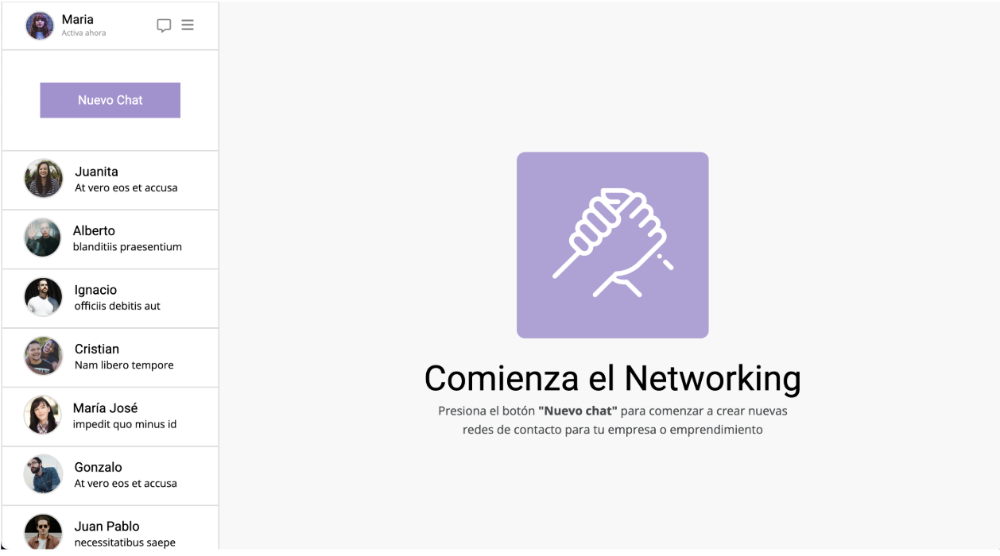

## Sistema de Mensajería

### Desafió 1 - Flexbox (Módulo CSS Avanzado)

Proyecto realizado aplicando conocimientos sobre creación de diseños responsivos con Flexbox.

<a href="https://isra-osvaldo.github.io/messaging-system/" target="_blank">Ver proyecto</a>
